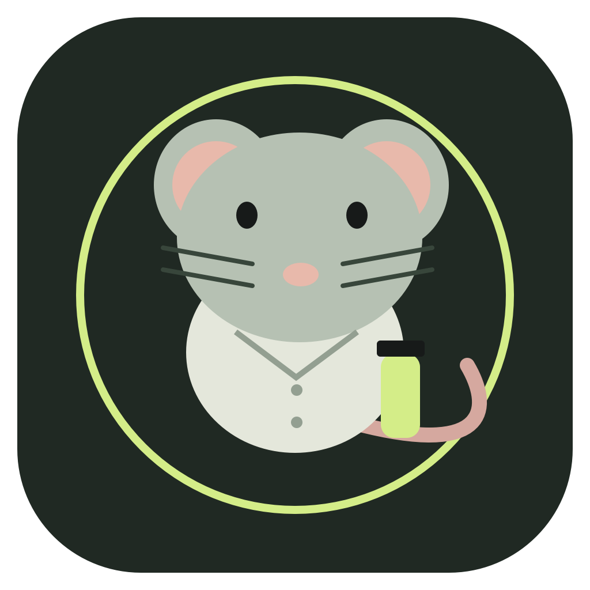

# Lab Rat 🐀

A tiny floating macOS companion for people doing research. You handle the science; the rat handles the clock.

**Native SwiftUI + AppKit · macOS 14+ · Local storage · No dependencies**

## Features

- **Runs, not Pomodoros.** Configurable focus and recovery timers, with explicit start and pause controls.
- **Experiment notebook.** Protocol checklists, notes, an active experiment, and a restorable archive.
- **Incubation timers.** Independent sample deadlines and temperature labels, including already-started incubations. Overdue samples stay visible until checked.
- **Floating bench buddy.** A draggable mouse in a lab coat, with an optional always-on-top setting.
- **Mouse app and menu-bar icons.** View the current experiment, countdown, and overdue status from the menu bar.
- **Lab calculators.** Dilution, reagent mass, molarity, blank-corrected OD600, and protein concentration using a supplied MW.
- **A small dose of science.** Lab facts with clickable primary-source references.
- **Fake PI approval.** Optional, very fake, and occasionally demanding more cheese.

## Build and run

Requires Xcode or compatible Swift tools with the macOS SDK. The source supports Apple silicon and Intel Macs; the build uses your Mac’s architecture.

```sh
chmod +x build.sh test.sh
./build.sh
open "dist/Lab Rat.app"
```

The build generates a native `.app`, its mouse icon, and a local ad hoc signature. No third-party packages or downloads are needed. The generated app is not notarized for public distribution.

To choose an output location:

```sh
./build.sh "/your/output/path/Lab Rat.app"
```

Open `Package.swift` in Xcode to edit the source. Launch the bundled app produced by `build.sh`; a bare Swift-package executable does not have the application bundle needed for macOS notifications and icons.

## Test

```sh
./test.sh
```

Six tests check dilution conservation, calculation units and invalid inputs, incubation deadlines, focus-phase completion, notebook persistence, and preservation of unreadable data.

Build and test scripts use a temporary scratch/cache directory. Set `LABRAT_BUILD_DIR` or `LABRAT_TEST_DIR` to reuse one. They currently select SwiftPM’s native build engine to avoid XCTest signing failures from Finder metadata in file-provider folders.

## Use

Create an experiment, enter one protocol step per line, and start a run. Add sample timers using your own protocol’s check times. Click **Float buddy** to show the companion. The app keeps running in the menu bar after windows close.

Enable optional system notifications in **Settings**. Experiment data is saved to `~/Library/Application Support/LabRat/state.json`; it is not part of this repository. Temperature is a user-entered label, and the app does not monitor samples or infer their stability.

See [the usage guide](docs/USAGE.md) for calculations, timing behavior, and backup details.

## Repository layout

```text
Assets/                 Mouse icon artwork, PNG and ICNS
Sources/LabRat/          Native app source
Tests/LabRatTests/       Core behavior tests
Tools/MakeIcon.swift     Reproducible icon generator
docs/                   Usage and GitHub upload instructions
Info.plist              App bundle metadata
Package.swift           Swift package definition
build.sh                Build and locally sign the app
test.sh                 Run the tests
```

Generated apps, build caches, signing credentials, and local notebook data are excluded by `.gitignore`. App icon assets are included for use in the README and future releases.

## Upload to GitHub

This folder is ready to become a repository. Follow [the upload instructions](docs/GITHUB_UPLOAD.md). Attach the separately packaged Mac app ZIP to a GitHub Release if you want to offer a download; keep the compiled app out of the source repository.
